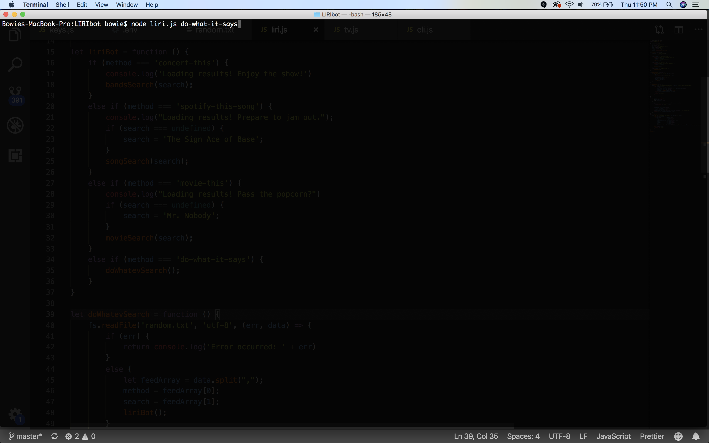
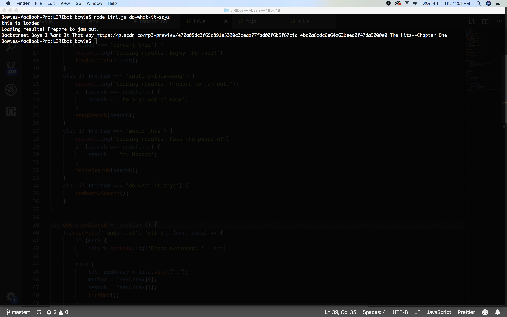
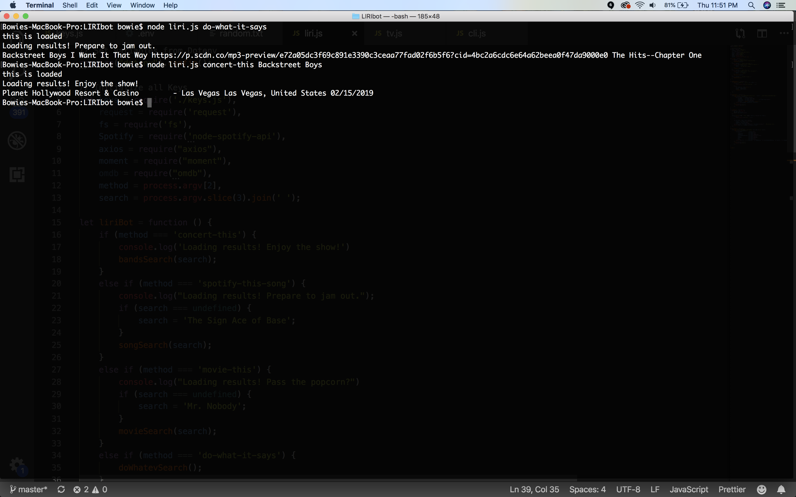
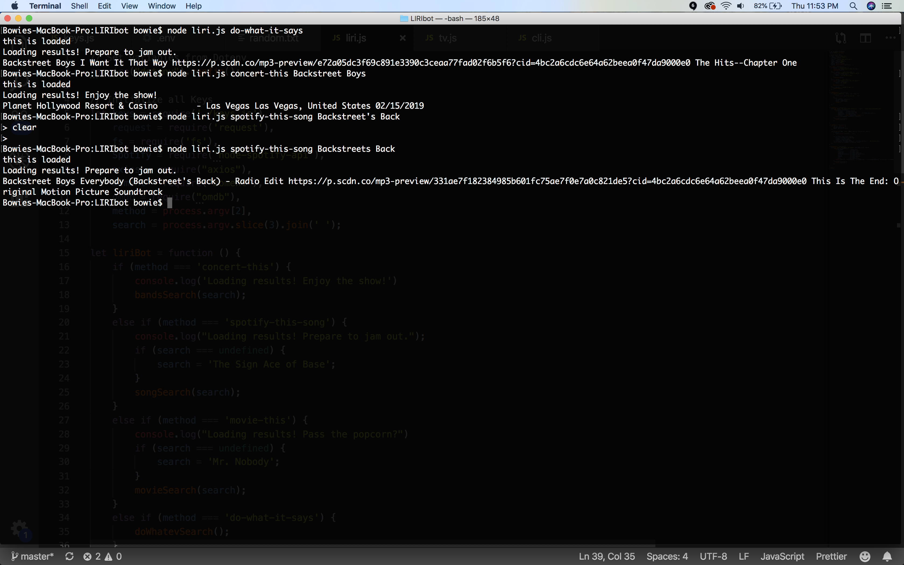
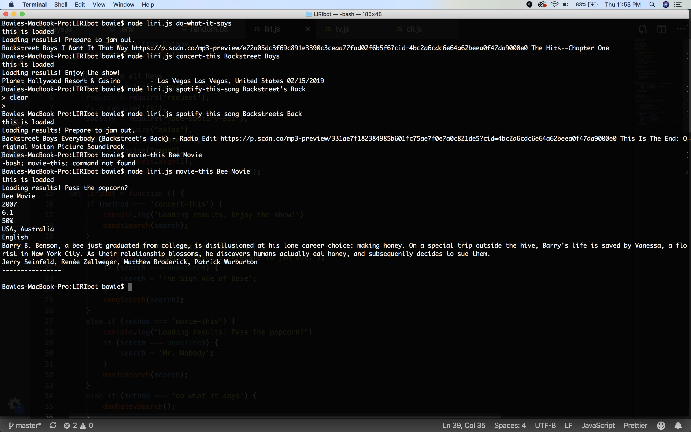

# LIRIbot

LIRIBot is an application that allows you to search by four distinct search strings:

do-what-it-says: this will provide anything written in random.txt to be searched.

concert-this <argument2>: this will search for the next concert applicable to the second argument and provide information appropriate to the show.

spotify-this-song <argument2>: this will search for a spotify song under this name and provide you details and a preview link (if no preview link, it will specify that!)

movie-this <argument2>: this will search for a movie by a given argument, and provide you many salient details regarding the film.

Note: I did not put in any sort of apostrophe etc handlers, so it just errors out!

